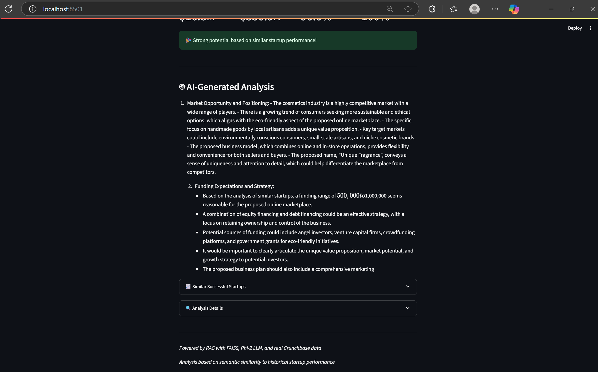
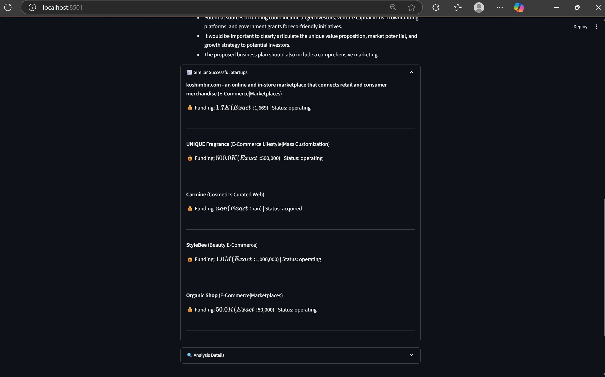
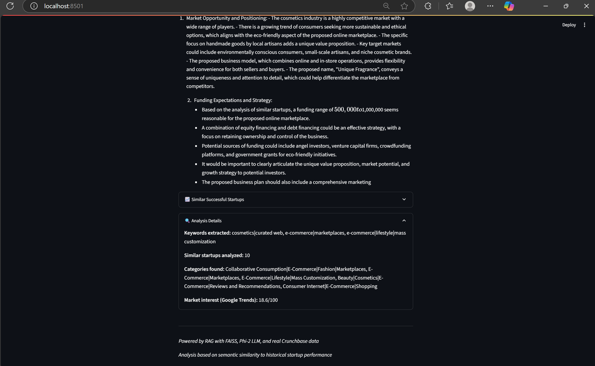

# 🚀 RAG-Enhanced Startup Idea Evaluator

  
  

> **Get AI‑powered insights** on your startup idea, grounded in **real Crunchbase data** and **Google Trends**, with a local LLM + RAG pipeline.

---

## ✨ Features

- **🔍 Keyword Extraction** via Phi‑2 LLM with few‑shot examples & fallback  
- **📈 Trend Analysis** using Google Trends data  
- **🤖 Semantic Matching** of keywords to Crunchbase categories (sentence‑transformers)  
- **🔄 Retrieval‑Augmented Generation (RAG)** with FAISS/Chroma and local embeddings  
- **📊 Data‑Driven Metrics**: average & median funding, success rate, confidence  
- **🎨 Streamlit UI**: smooth dark‑mode interface with metrics, expanders, and analysis  

---

## 📸 Screenshots

### 1️⃣ Enter Your Idea, Evaluate & See Key Metrics

### 2️⃣ AI‑Generated Analysis  

### 3️⃣ Dive into Similar Startups  

### 4️⃣ Basic Analysis Details  

---
